## 📦 Installation

In your `pubspec.yaml`, add:

```bash
flutter pub add verif_id
```

---

## 🔑 Permissions & Platform Setup

This package requires **Camera**, **Microphone**, and **Storage** access.

### ✅ Android

Edit `android/app/src/main/AndroidManifest.xml`:

```xml
<uses-permission android:name="android.permission.CAMERA"/>
<uses-permission android:name="android.permission.RECORD_AUDIO"/>
<uses-permission android:name="android.permission.READ_EXTERNAL_STORAGE"/>
<uses-permission android:name="android.permission.WRITE_EXTERNAL_STORAGE"/>

    <uses-feature android:name="android.hardware.camera" android:required="true" />

<application ...>
</application>
```

👉 If targeting **Android 13+**, runtime permissions are handled automatically via [`permission_handler`](https://pub.dev/packages/permission_handler).

---

### 🍏 iOS

**1. Edit `ios/Runner/Info.plist`:**

```xml
<key>NSCameraUsageDescription</key>
<string>This app requires camera access for identity verification.</string>

<key>NSMicrophoneUsageDescription</key>
<string>This app requires microphone access for video recording.</string>

<key>NSPhotoLibraryUsageDescription</key>
<string>This app may save temporary files during verification.</string>
```

**2. ⚠️ CRITICAL: Configure `ios/Podfile`**

Add the permission_handler configuration to your `ios/Podfile`:

```ruby
post_install do |installer|
  installer.pods_project.targets.each do |target|
    flutter_additional_ios_build_settings(target)

    target.build_configurations.each do |config|
      config.build_settings['GCC_PREPROCESSOR_DEFINITIONS'] ||= [
        '$(inherited)',

        ## dart: PermissionGroup.camera
        'PERMISSION_CAMERA=1',

        ## dart: PermissionGroup.microphone
        'PERMISSION_MICROPHONE=1',

        ## dart: PermissionGroup.photos
        'PERMISSION_PHOTOS=1',
      ]
    end
  end
end
```

**3. Clean and rebuild after Podfile changes:**

```bash
cd ios && rm -rf Pods Podfile.lock && cd ..
flutter clean
flutter pub get
flutter run
```

---

### 🌐 Web

- Works on modern browsers with **camera + mic support**.
- Must be served over **HTTPS**.
- User will be prompted for permissions automatically.

---

## 🚀 Usage

### Basic Example

```dart
import 'package:flutter/material.dart';
import 'package:verif_id/verif_id.dart';

class KycPage extends StatelessWidget {
  const KycPage({super.key});

  @override
  Widget build(BuildContext context) {
    return Scaffold(
      appBar: AppBar(title: const Text("KYC Verification")),
      body: VerifId(
        sessionId: "user-session-001",
        onSubmit: (data) async {
          // Send KYC data to your server
          print("Submitted data: $data");
        },
      ),
    );
  }
}
```

---

## ⚙️ Parameters

| Parameter   | Type                             | Default              | Description                                                                   |
| ----------- | -------------------------------- | -------------------- | ----------------------------------------------------------------------------- |
| `sessionId` | `String`                         | `null`               | Unique identifier for the verification session (useful for backend tracking). |
| `onSubmit`  | `Future<void> Function(KYCData)` | **required**         | Callback fired once the user submits the verification flow.                   |
| `enableTts` | `bool`                           | `true`               | Whether to enable French female voice TTS guidance.                           |
| `locale`    | `Locale`                         | `Locale('fr', 'FR')` | Locale for TTS (currently optimized for French).                              |

---

## 🖼 Steps in the Flow

1. **Selfie Step** → User takes a selfie.
2. **Video Step** → User records a **5s video** for liveness detection.
3. **ID Front Step** → Capture the **front of the ID card**.
4. **ID Back Step** → Capture the **back of the ID card**.
5. **Review & Submit** → User reviews captures, can re-verify, then submits.

---

## 📊 Flow Diagram

```mermaid
flowchart TD
    A[Start Verification] --> B[Take Selfie]
    B --> C[Record 5s Selfie Video]
    C --> D[Capture ID Front]
    D --> E[Capture ID Back]
    E --> F[Review All Captures]
    F -->|Submit| G[Send Data to Backend]
    F -->|Re-verify| B
    G --> H[Done ✅]
```



---

## 🔄 Sequence Diagram

```mermaid
sequenceDiagram
    participant User
    participant App
    participant TTS
    participant Backend

    User->>App: Start Verification
    App->>TTS: "Prenez un selfie"
    User->>App: Capture Selfie
    App->>TTS: "Enregistrez une vidéo de 5 secondes"
    User->>App: Record Video
    App->>TTS: "Scannez la face avant de votre carte"
    User->>App: Capture ID Front
    App->>TTS: "Scannez la face arrière de votre carte"
    User->>App: Capture ID Back
    App->>User: Show Review Screen
    User->>App: Submit
    App->>Backend: Upload KYC Data
    Backend-->>App: Verification Complete
    App-->>User: Done ✅
```



---

## 💡 Use Cases

- **Fintech apps** → Customer onboarding (banking, wallets, payments)
- **Marketplace apps** → Seller verification
- **Rental platforms** → Tenant / vehicle renter verification
- **Health services** → Patient ID confirmation

---

## 📋 Roadmap

- [ ] OCR integration for auto-extracting ID data
- [ ] Multi-language TTS support (English, Spanish, etc.)
- [ ] Optional selfie-with-ID capture
- [ ] Server API helpers

---

## ⚖️ License

MIT © 2025 Freddy dro
